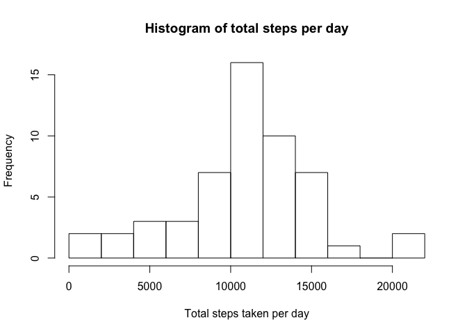
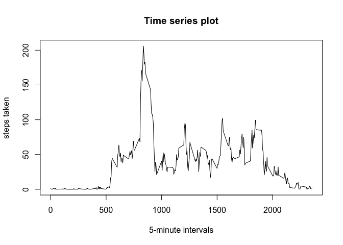
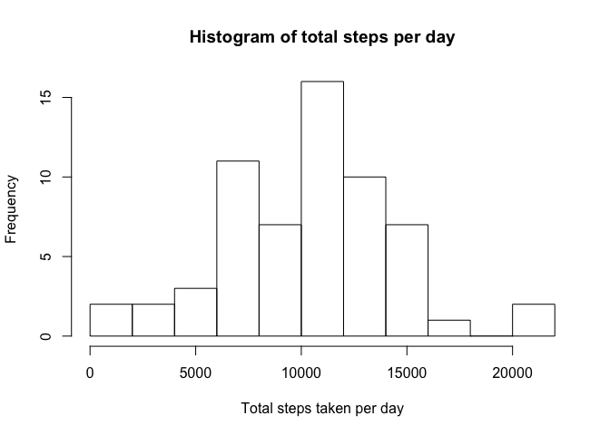
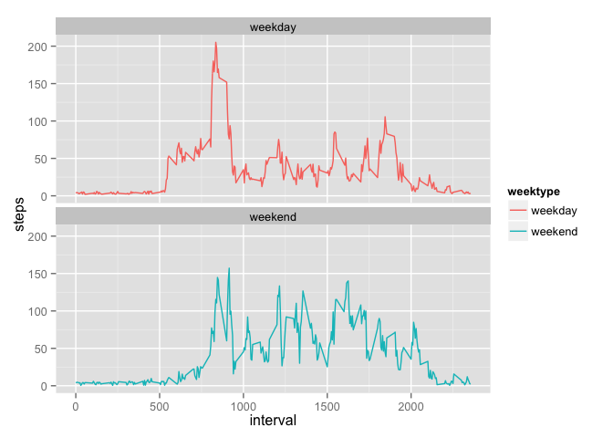

## Reproducible Research - PA 1        
by L.R. Adrichem  

Let's start with loading the data and the required packages


```r
data <- read.csv("downloads/activity.csv", header = T, sep = ",")
library(dplyr)
```

```
## 
## Attaching package: 'dplyr'
## 
## The following objects are masked from 'package:stats':
## 
##     filter, lag
## 
## The following objects are masked from 'package:base':
## 
##     intersect, setdiff, setequal, union
```

```r
library(ggplot2)
```

###What is mean total number of steps taken per day?  
- Calculate the total number of steps taken per day  

I will use the dplyr package here, use a group_by
and then summarize the sum of steps. First I want to  
filter out the NA values though, for that otherwise
everyday that has a NA value will sum up to NA.


```r
data$date <- as.Date(data$date)
dayTotal <- data %>%
        filter(!is.na(steps)) %>%
        group_by(date) %>%
        summarise(total_steps=sum(steps))
```

- Make a histogram of the total number of steps taken each day


```r
hist(dayTotal$total_steps, breaks = 15, xlab = "Total steps taken per day", main = "Histogram of total steps per day")
```

 

- Calculate and report the mean and median of the total number of steps taken per day


```r
mean(dayTotal$total_steps)
```

```
## [1] 10766.19
```

```r
median(dayTotal$total_steps)
```

```
## [1] 10765
```

### What is the average daily activity pattern?  
- Make a time series plot (i.e. type = "l") of the 5-minute interval (x-axis) and the average number of steps taken, averaged across all days (y-axis)  


```r
timeSeries <- data %>%
        filter(!is.na(steps)) %>%
        group_by(interval) %>%
        summarise(average_steps=mean(steps))
plot(timeSeries$interval, timeSeries$average_steps, type = "l", xlab = "5-minute intervals", 
     ylab = "steps taken", main = "Time series plot")
```

 

- Which 5-minute interval, on average across all the days in the dataset, contains the maximum number of steps?


```r
timeSeries[timeSeries$average_steps == max(timeSeries$average_steps),]
```

```
## Source: local data frame [1 x 2]
## 
##   interval average_steps
##      (int)         (dbl)
## 1      835      206.1698
```

### Imputing missing values  
- Calculate and report the total number of missing values in the dataset (i.e. the total number of rows with NAs)


```r
sum(is.na(data))
```

```
## [1] 2304
```

- Devise a strategy for filling in all of the missing values in the dataset.
Since it does not have to be sophisticated, I choose to replace all NA values with  random
values between 0 and 15. No particulate reason behind it, just for fun.

- Create a new dataset that is equal to the original dataset but with the missing data filled in.


```r
dataWithoutNA <- data
dataWithoutNA[is.na(dataWithoutNA)] = sample(0:50, 2304, replace = T)
```

- Make a histogram of the total number of steps taken each day and Calculate and report the mean and median total number of steps taken per day.


```r
dayTotal2 <- dataWithoutNA %>%
        filter(!is.na(steps)) %>%
        group_by(date) %>%
        summarise(total_steps=sum(steps))

hist(dayTotal2$total_steps, breaks = 15, xlab = "Total steps taken per day", main = "Histogram of total steps per day")
```

 

```r
mean(dayTotal2$total_steps)
```

```
## [1] 10277.15
```

```r
median(dayTotal2$total_steps)
```

```
## [1] 10395
```

- Do these values differ from the estimates from the first part of the assignment? 
-- both mean and median are lower  

- What is the impact of imputing missing data on the estimates of the total daily number of steps?
-- More skewed towards lower values

### Are there differences in activity patterns between weekdays and weekends?

- Create a new factor variable in the dataset with two levels – “weekday” and “weekend” indicating whether a given date is a weekday or weekend day.


```r
Sys.setlocale("LC_TIME", "en_US")
```

```
## [1] "en_US"
```

```r
dataWithoutNA <- mutate(dataWithoutNA, weektype = ifelse(weekdays(dataWithoutNA$date) == "Saturday" | weekdays(dataWithoutNA$date) == "Sunday", "weekend", "weekday"))

head(dataWithoutNA)
```

```
##   steps       date interval weektype
## 1     0 2012-10-01        0  weekday
## 2    18 2012-10-01        5  weekday
## 3    31 2012-10-01       10  weekday
## 4    15 2012-10-01       15  weekday
## 5    20 2012-10-01       20  weekday
## 6    26 2012-10-01       25  weekday
```

- Make a panel plot containing a time series plot (i.e. type = "l") of the 5-minute interval (x-axis) and the average number of steps taken, averaged across all weekday days or weekend days (y-axis)


```r
interval_full <- dataWithoutNA %>%
  group_by(interval, weektype) %>%
  summarise(steps = mean(steps))
s <- ggplot(interval_full, aes(x=interval, y=steps, color = weektype)) +
  geom_line() +
  facet_wrap(~weektype, ncol = 1, nrow=2)
print(s)
```

 


